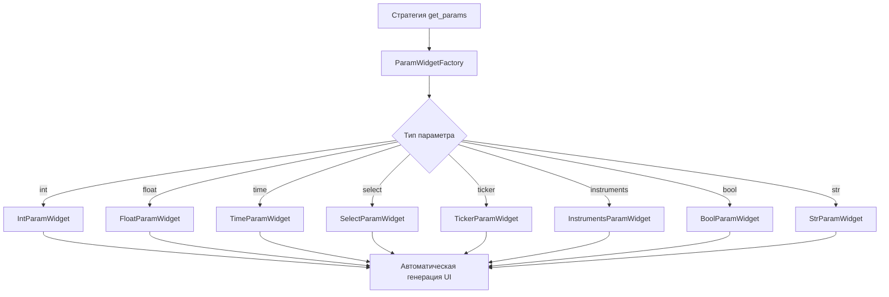

# План: Автоматическая генерация UI для параметров стратегий

## Проблема

Сейчас при добавлении новой стратегии нужно вручную прописывать код для генерации полей настроек в [`ui/strategy_window.py`](ui/strategy_window.py:528). Это приводит к:
- Дублированию кода
- Необходимости модифицировать UI при добавлении новых типов параметров
- Риску ошибок и несоответствий между стратегией и UI

## Текущая архитектура

### Определение параметров в стратегии

Каждая стратегия определяет параметры через функцию [`get_params()`](strategies/daytrend.py:21):

```python
def get_params() -> dict:
    return {
        "sma_period": {
            "type": "int",
            "default": 200,
            "min": 5,
            "max": 2000,
            "label": "Период SMA",
            "description": "Период скользящей средней",
        },
        "time_start": {
            "type": "time",
            "default": 605,
            "label": "Время входа (мин)",
            "description": "Начало торговли",
        },
        # ...
    }
```

### Генерация UI

В [`strategy_window.py:528-633`](ui/strategy_window.py:528) метод `tab_params()` читает схему и создаёт виджеты:

```python
for key, meta in schema.items():
    ptype = meta.get("type", "str")
    if ptype == "int":
        widget = QSpinBox()
        widget.setRange(meta.get("min", 0), meta.get("max", 1_000_000))
        # ...
    elif ptype == "float":
        widget = QDoubleSpinBox()
        # ...
    # и т.д. для каждого типа
```

## Решение: Фабрика виджетов параметров

### Архитектура



### Компоненты

#### 1. Базовый класс параметра

Файл: [`ui/param_widgets.py`](ui/param_widgets.py:1) (новый)

```python
class BaseParamWidget(QWidget):
    """Базовый класс для виджета параметра стратегии"""
    
    def __init__(self, key: str, meta: dict, current_value, parent=None):
        self.key = key
        self.meta = meta
        self.current_value = current_value
        
    def get_value(self):
        """Возвращает текущее значение параметра"""
        raise NotImplementedError
        
    def set_value(self, value):
        """Устанавливает значение параметра"""
        raise NotImplementedError
```

#### 2. Реализации для каждого типа

- `IntParamWidget` - QSpinBox с автоматическим применением min/max
- `FloatParamWidget` - QDoubleSpinBox с decimals, step
- `TimeParamWidget` - QTimeEdit с конвертацией минут
- `SelectParamWidget` - QComboBox с options/labels
- `TickerParamWidget` - обёртка над TickerSelector
- `InstrumentsParamWidget` - обёртка над _InstrumentsWidget
- `BoolParamWidget` - QCheckBox
- `StrParamWidget` - QLineEdit

#### 3. Фабрика виджетов

```python
class ParamWidgetFactory:
    """Фабрика для создания виджетов параметров"""
    
    _registry = {
        "int": IntParamWidget,
        "float": FloatParamWidget,
        "time": TimeParamWidget,
        "select": SelectParamWidget,
        "choice": SelectParamWidget,
        "ticker": TickerParamWidget,
        "instruments": InstrumentsParamWidget,
        "bool": BoolParamWidget,
        "str": StrParamWidget,
    }
    
    @classmethod
    def create(cls, key: str, meta: dict, current_value, connector_id: str = None):
        ptype = meta.get("type", "str")
        widget_class = cls._registry.get(ptype, StrParamWidget)
        return widget_class(key, meta, current_value, connector_id)
    
    @classmethod
    def register(cls, type_name: str, widget_class):
        """Регистрация нового типа виджета"""
        cls._registry[type_name] = widget_class
```

#### 4. Рефакторинг tab_params()

```python
def tab_params(self) -> QWidget:
    # ...
    schema = self.loaded.params_schema
    params = self.data.get("params", {})
    connector_id = self.data.get("connector", "finam")
    
    self._param_widgets: dict = {}
    
    for key, meta in schema.items():
        current = params.get(key, meta.get("default", ""))
        
        # Создаём виджет через фабрику
        widget = ParamWidgetFactory.create(
            key=key,
            meta=meta,
            current_value=current,
            connector_id=connector_id
        )
        
        self._param_widgets[key] = widget
        label = meta.get("label", key)
        form.addRow(f"{label}:", widget)
    
    # ...
```

## Преимущества решения

1. **Расширяемость**: Новые типы параметров добавляются через `ParamWidgetFactory.register()`
2. **Единообразие**: Все виджеты следуют единому интерфейсу
3. **Переиспользование**: Виджеты можно использовать в других частях UI
4. **Валидация**: Каждый виджет инкапсулирует логику валидации своего типа
5. **Тестируемость**: Каждый тип виджета можно тестировать отдельно

## Поддерживаемые типы параметров

| Тип | Виджет | Метаданные | Пример |
|-----|--------|------------|--------|
| `int` | QSpinBox | min, max, step | Период SMA |
| `float` | QDoubleSpinBox | min, max, step, decimals | Коэффициент K |
| `time` | QTimeEdit | - | Время входа |
| `select`/`choice` | QComboBox | options, labels | Тип заявки |
| `ticker` | TickerSelector | - | Тикер инструмента |
| `instruments` | InstrumentsWidget | - | Корзина инструментов |
| `bool` | QCheckBox | - | Динамический лот |
| `str` | QLineEdit | - | Название агента |

## Обратная совместимость

Решение полностью обратно совместимо:
- Существующие стратегии продолжат работать без изменений
- Схема параметров [`get_params()`](strategies/daytrend.py:21) остаётся прежней
- UI автоматически адаптируется под любую схему

## Дополнительные улучшения

### 1. Валидация на уровне UI

Каждый виджет может валидировать значение перед сохранением:

```python
class IntParamWidget(BaseParamWidget):
    def validate(self) -> tuple[bool, str]:
        value = self.get_value()
        min_val = self.meta.get("min")
        max_val = self.meta.get("max")
        
        if min_val is not None and value < min_val:
            return False, f"Значение должно быть >= {min_val}"
        if max_val is not None and value > max_val:
            return False, f"Значение должно быть <= {max_val}"
            
        return True, ""
```

### 2. Условная видимость параметров

Можно добавить поддержку зависимых параметров:

```python
"use_stop_loss": {
    "type": "bool",
    "default": False,
    "label": "Использовать стоп-лосс",
},
"stop_loss_value": {
    "type": "float",
    "default": 100.0,
    "label": "Значение стоп-лосса",
    "visible_if": {"use_stop_loss": True},  # показывать только если use_stop_loss=True
}
```

### 3. Группировка параметров

Можно добавить группировку для лучшей организации:

```python
"sma_period": {
    "type": "int",
    "group": "Индикаторы",
    "label": "Период SMA",
}
```

## Миграция

### Этап 1: Создание фабрики виджетов
- Создать [`ui/param_widgets.py`](ui/param_widgets.py:1)
- Реализовать базовый класс и все типы виджетов
- Покрыть unit-тестами

### Этап 2: Рефакторинг strategy_window.py
- Заменить ручную генерацию на вызовы фабрики
- Сохранить обратную совместимость
- Протестировать на всех существующих стратегиях

### Этап 3: Документация
- Создать руководство по добавлению новых типов параметров
- Обновить примеры стратегий

## Пример использования

### До (текущий код)

```python
# В strategy_window.py нужно вручную добавлять код для каждого типа
if ptype == "int":
    widget = QSpinBox()
    widget.setRange(meta.get("min", 0), meta.get("max", 1_000_000))
    widget.setValue(int(current))
    widget.setFixedWidth(120)
elif ptype == "float":
    widget = QDoubleSpinBox()
    # ... ещё 10 строк кода
```

### После (с фабрикой)

```python
# Просто создаём виджет через фабрику
widget = ParamWidgetFactory.create(key, meta, current, connector_id)
form.addRow(f"{meta.get('label', key)}:", widget)
```

### Добавление нового типа

```python
# Создаём класс виджета
class ColorParamWidget(BaseParamWidget):
    def __init__(self, key, meta, current_value, connector_id=None):
        super().__init__(key, meta, current_value)
        self.color_button = QPushButton()
        # ... логика выбора цвета
    
    def get_value(self):
        return self.selected_color

# Регистрируем в фабрике
ParamWidgetFactory.register("color", ColorParamWidget)

# Используем в стратегии
def get_params():
    return {
        "line_color": {
            "type": "color",
            "default": "#89b4fa",
            "label": "Цвет линии",
        }
    }
```

## Заключение

Предложенное решение полностью решает проблему ручного прописывания UI для параметров стратегий. Система становится:
- **Автоматической**: UI генерируется из схемы параметров
- **Расширяемой**: Новые типы добавляются без изменения существующего кода
- **Надёжной**: Единая точка валидации и обработки параметров
- **Удобной**: Разработчику стратегии достаточно описать параметры в [`get_params()`](strategies/daytrend.py:21)
