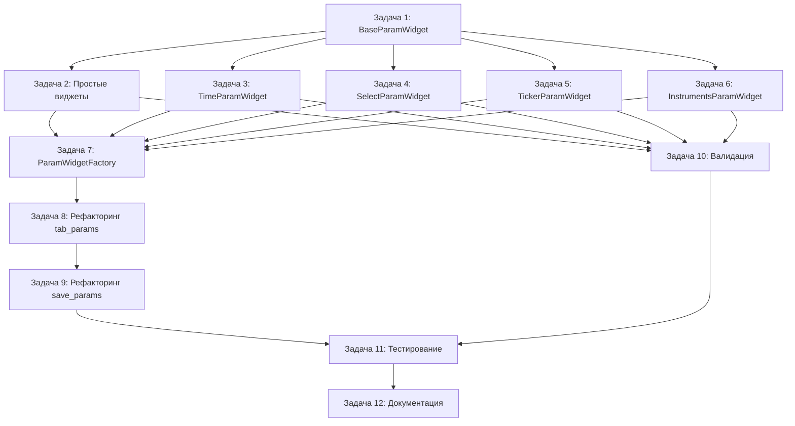

# Задачи для реализации автогенерации UI параметров

## Разбивка на атомарные задачи

### Задача 1: Создание базового класса BaseParamWidget
**Файл**: `ui/param_widgets.py` (новый)

**Описание**: Создать абстрактный базовый класс для всех виджетов параметров

**Детали**:
- Определить интерфейс `get_value()` и `set_value()`
- Добавить метод `validate()` для валидации
- Сохранять метаданные параметра (key, meta, current_value)
- Поддержка tooltip из description

**Зависимости**: Нет

---

### Задача 2: Реализация простых виджетов параметров
**Файл**: `ui/param_widgets.py`

**Описание**: Реализовать виджеты для простых типов: str, int, float, bool

**Детали**:
- `StrParamWidget` - QLineEdit
- `IntParamWidget` - QSpinBox с автоматическим min/max
- `FloatParamWidget` - QDoubleSpinBox с decimals, step
- `BoolParamWidget` - QCheckBox

**Зависимости**: Задача 1

---

### Задача 3: Реализация виджета TimeParamWidget
**Файл**: `ui/param_widgets.py`

**Описание**: Виджет для параметров типа time (минуты от полуночи)

**Детали**:
- Использовать QTimeEdit с форматом HH:mm
- Конвертация минут ↔ QTime
- Метод `get_value()` возвращает int (минуты)

**Зависимости**: Задача 1

---

### Задача 4: Реализация виджета SelectParamWidget
**Файл**: `ui/param_widgets.py`

**Описание**: Виджет для параметров типа select/choice

**Детали**:
- Использовать QComboBox
- Поддержка options и labels из метаданных
- Метод `get_value()` возвращает выбранное значение (не индекс)

**Зависимости**: Задача 1

---

### Задача 5: Реализация виджета TickerParamWidget
**Файл**: `ui/param_widgets.py`

**Описание**: Обёртка над существующим TickerSelector

**Детали**:
- Интеграция с `ui.ticker_selector.TickerSelector`
- Передача connector_id
- Поддержка board для QUIK
- Методы `get_value()` возвращает ticker, `get_board()` возвращает board

**Зависимости**: Задача 1

---

### Задача 6: Реализация виджета InstrumentsParamWidget
**Файл**: `ui/param_widgets.py`

**Описание**: Обёртка над существующим _InstrumentsWidget

**Детали**:
- Интеграция с `_InstrumentsWidget` из strategy_window.py
- Передача connector_id
- Метод `get_value()` возвращает список инструментов

**Зависимости**: Задача 1

---

### Задача 7: Создание ParamWidgetFactory
**Файл**: `ui/param_widgets.py`

**Описание**: Фабрика для создания виджетов по типу параметра

**Детали**:
- Реестр типов → классов виджетов
- Метод `create(key, meta, current_value, connector_id)`
- Метод `register(type_name, widget_class)` для расширения
- Fallback на StrParamWidget для неизвестных типов

**Зависимости**: Задачи 2-6

---

### Задача 8: Рефакторинг tab_params() в strategy_window.py
**Файл**: `ui/strategy_window.py`

**Описание**: Заменить ручную генерацию виджетов на использование фабрики

**Детали**:
- Удалить большой блок if/elif для типов параметров
- Использовать `ParamWidgetFactory.create()` в цикле
- Сохранить обратную совместимость
- Обработка специальных случаев (ticker с board)

**Зависимости**: Задача 7

---

### Задача 9: Рефакторинг save_params() в strategy_window.py
**Файл**: `ui/strategy_window.py`

**Описание**: Обновить метод сохранения параметров для работы с новыми виджетами

**Детали**:
- Использовать `widget.get_value()` вместо прямого доступа
- Обработка специальных случаев (ticker + board)
- Валидация перед сохранением

**Зависимости**: Задача 8

---

### Задача 10: Добавление валидации параметров
**Файл**: `ui/param_widgets.py`

**Описание**: Реализовать валидацию в каждом виджете

**Детали**:
- Метод `validate()` возвращает `(bool, str)` - успех и сообщение об ошибке
- Проверка min/max для числовых типов
- Проверка options для select
- Визуальная индикация ошибок (красная рамка)

**Зависимости**: Задачи 2-6

---

### Задача 11: Тестирование на существующих стратегиях
**Файлы**: Все стратегии в `strategies/`

**Описание**: Проверить работу автогенерации на всех стратегиях

**Детали**:
- daytrend.py - int, float, time
- valera_trend.py - int, time, ticker
- tracker.py - int, float, time, ticker
- achilles.py - time, float, select, instruments
- Проверить сохранение и загрузку параметров

**Зависимости**: Задача 9

---

### Задача 12: Создание документации
**Файл**: `docs/strategy_params_guide.md` (новый)

**Описание**: Руководство по работе с параметрами стратегий

**Детали**:
- Описание всех поддерживаемых типов
- Примеры использования каждого типа
- Как добавить новый тип параметра
- Примеры валидации

**Зависимости**: Задача 11

---

## Порядок выполнения

## Оценка сложности

| Задача | Сложность | Приоритет |
|--------|-----------|-----------|
| 1 | Низкая | Высокий |
| 2 | Низкая | Высокий |
| 3 | Средняя | Высокий |
| 4 | Низкая | Высокий |
| 5 | Средняя | Высокий |
| 6 | Средняя | Высокий |
| 7 | Низкая | Высокий |
| 8 | Высокая | Высокий |
| 9 | Средняя | Высокий |
| 10 | Средняя | Средний |
| 11 | Средняя | Высокий |
| 12 | Низкая | Средний |

## Критические моменты

1. **Обратная совместимость**: Существующие стратегии должны работать без изменений
2. **Специальные случаи**: ticker + board для QUIK требует особой обработки
3. **Синхронизация тикеров**: Между вкладками Параметры и Ручной ордер
4. **Блокировка редактирования**: При активной стратегии виджеты должны блокироваться

## Риски и митигация

| Риск | Вероятность | Митигация |
|------|-------------|-----------|
| Поломка существующего функционала | Средняя | Тщательное тестирование на всех стратегиях |
| Проблемы с синхронизацией тикеров | Низкая | Сохранить существующую логику синхронизации |
| Производительность при большом количестве параметров | Низкая | Виджеты создаются один раз при открытии окна |
| Сложность добавления новых типов | Низкая | Чёткая документация и примеры |
